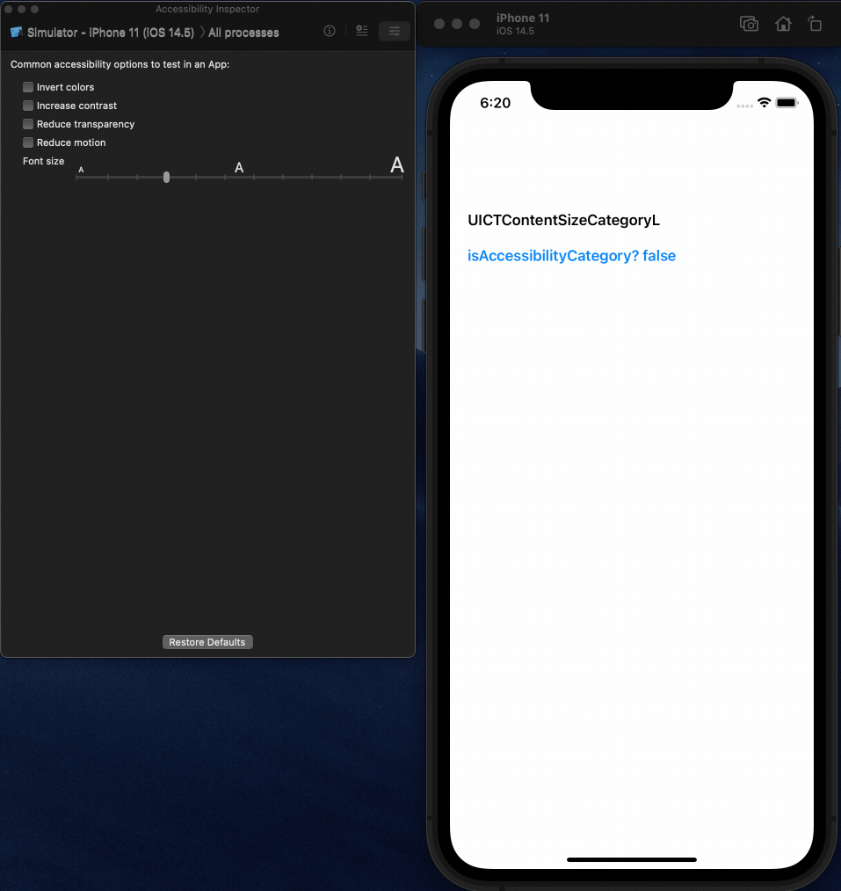
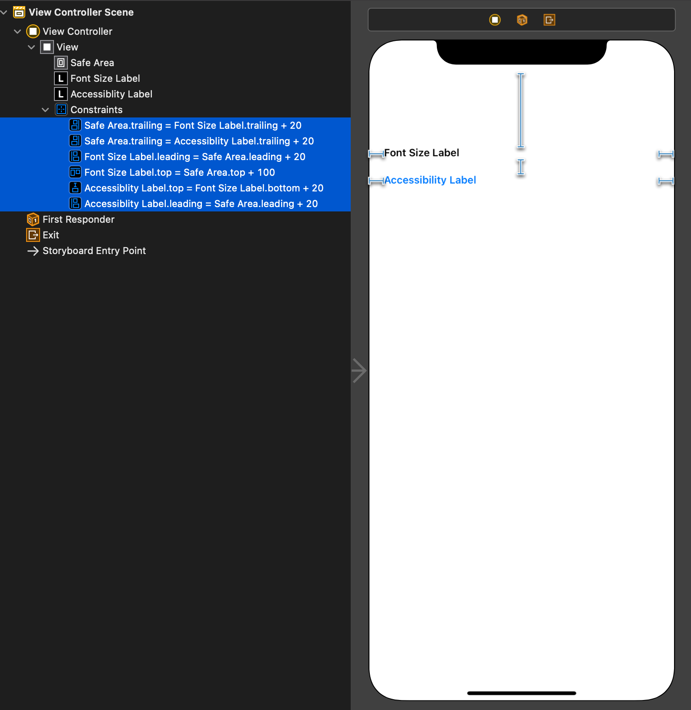
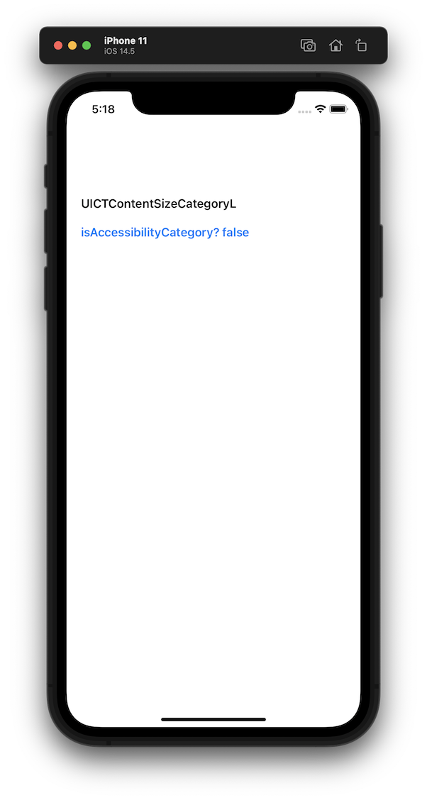

# [공식문서로 iOS 배우기] 텍스트 크기 설정값 가져오기 예제

- 공식 자료로 학습한 내용을 바탕으로 만든 예제이며 잘못된 정보가 있을 수 있습니다.
- 참고한 공식 자료: Documentation > UIKit > UIApplication > Topics > [Getting the Font Sizing Preference](https://developer.apple.com/documentation/uikit/uiapplication)
- 학습 내용 정리: UIApplication > [Getting the Font Sizing Preference](./Getting-the-Font-Sizing-Preference.md)
- 예제 프로젝트 전체 코드: [GettingTheFontSizingPreference](./GettingTheFontSizingPreference/)

**Index**
- [예제 설명](#예제-설명)
- [프로젝트 셋팅](#프로젝트-셋팅)
- [텍스트 크기 설정값 표시하기](#텍스트-크기-설정값-표시하기)
- [변경한 텍스트 크기 설정값을 바로 표시하기](#변경한-텍스트-크기-설정값을-바로-표시하기)

   

## 예제 설명

텍스트 크기 설정값을 가져오고 이를 확인할 수 있게 Label에 표시하기.  
사용자가 텍스트 크기 설정을 변경하면 즉시 앱에 적용하기.

   

## 프로젝트 셋팅

Xcode에서 새 iOS App 프로젝트를 생성한다.

### 1. 텍스트 크기 설정값을 표시할 Label 추가

스토리보드의 `ViewController`에 Label 2개를 추가하고 아웃렛을 생성한다.

~~~swift
@IBOutlet weak var fontSizeLabel: UILabel!
@IBOutlet weak var accessiblityLabel: UILabel!
~~~
  
### 2. Label의 Attributes Inspector 설정

- 1에서 추가한 Label에 각각 `Font Size Label`과 `Accessibility Label`를 입력한다.
- Font: Text Styles - Headline
    - Text Styles의 폰트는 모두 Dynamic Type을 지원하므로 여기서 마음에드는 폰트로 해도 상관없다.
- Dynamic Type: Automatically Adjusts Font 체크박스 체크 
    - 체크해야 Dynamic Type이 적용되어 텍스트 크기 설정에 따라 크기가 변한다.
- Color
    - Font Size Label: Default
    - Accessibility Label: System Blue

### 3. 오토 레이아웃 설정

Label은 컨텐츠(텍스트)의 크기에 따라 Intrinsic Size가 자동으로 계산되므로 오토 레이아웃을 설정할 때 위치에 관한 제약만 주면 된다.
  
Laeding, Trailing, Top Constraint만 적절히 설정한다.

프로젝트 셋팅이 완료됐다. 이제 기능을 추가한다.

   

## 텍스트 크기 설정값 표시하기

현재 적용된 텍스트 크기 설정값을 가져와서 Label에 표시해보자.  

### 코드 

`ViewController`의 `viewDidLoad()`에 아래 코드를 추가한다.

~~~swift
// 현재 텍스트 크기 설정 표시
fontSizeLabel.text = UIApplication.shared.preferredContentSizeCategory.rawValue
accessiblityLabel.text = "isAccessibilityCategory? \(UIApplication.shared.preferredContentSizeCategory.isAccessibilityCategory)"
~~~

- preferredContentSizeCategory 👉 [공식문서](https://developer.apple.com/documentation/uikit/uiapplication/1623048-preferredcontentsizecategory)
    - UIApplication의 인스턴스 프로퍼티로 사용자가 설정한 텍스트 크기 옵션 값(UIContentSizeCategory)을 확인할 수 있다.
- isAccessibilityCategory 👉 [공식문서](https://developer.apple.com/documentation/uikit/uicontentsizecategory/2897444-isaccessibilitycategory)
     - 텍스트 크기 옵션 값이 접근성 카테고리인지 여부
     - 텍스트 크기는 기본 크기에 추가로 더 큰 접근성 크기가 있는데, 옵션 값이 접근성 크기인지 여부를 확인한다.

### 동작

시뮬레이터로 확인해 보자.

텍스트 크기는 L(Large)이고, 접근성 크기가 아닌 것을 확인할 수 있다.

   

## 변경한 텍스트 크기 설정값을 바로 표시하기

위 예제에서는 사용자가 옵션을 변경한다면 바로 표시 되지 않고, 앱을 껏다 켜야만 변경한 옵션을 볼 수 있다.  
물론 텍스트의 크기 자체는 iOS에서 자동으로 적용되므로 바로 크기가 변하지만,  
어떤 옵션으로 변경했는지 Label에 표시하는 기능은 직접 만든 기능이므로, 변경 즉시 업데이트하려면 추가 처리가 필요하다.
  
UIApplication [공식문서](https://developer.apple.com/documentation/uikit/uiapplication)의 Getting the Font Sizing Prefrerence를 보면 사용자가 텍스트 크기 설정을 변경했을 때 알려주는 노티피케이션이 있으므로 이를 활용한다.

### 코드 

`viewDidLoad()`에 아래 코드를 추가한다.

~~~swift
// 텍스트 크기 설정 변경을 알려주는 노티피케이션 등록
NotificationCenter.default.addObserver(forName: UIContentSizeCategory.didChangeNotification, object: nil, queue: .main) { (notification) in
    guard let preferredContentSizeCategory = notification.userInfo?[UIContentSizeCategory.newValueUserInfoKey] as? UIContentSizeCategory else {
        return
    }
    self.fontSizeLabel.text = preferredContentSizeCategory.rawValue
    self.accessiblityLabel.text = "isAccessibilityCategory? \(preferredContentSizeCategory.isAccessibilityCategory)"
}
~~~

- addObser로 노티피케이션을 등록한다.
    - `UIContentSizeCategory.didChangeNotification`: 사용자가 텍스트 크기 옵션을 설정하면 알려주는 노티피케이션의 이름
    - `queue: .main`: 노티피케이션을 받으면 Label을 업데이트하므로 main 쓰레드로 지정한다
  
그리고 예제 프로젝트라 큰 문제는 없지만, 노티피케이션을 제거하는 습관을 들여주자.

~~~swift
deinit {
    // 노티피케이션 제거
    NotificationCenter.default.removeObserver(self, name: UIContentSizeCategory.didChangeNotification, object: nil)
}
~~~

### 동작

시뮬레이터로 확인해 보자.

`설정 - 손쉬운 사용 - 디스플레이 및 텍스트 크기 - 더 큰 텍스트`에서 설정값을 직접 변경해서 확인할 수 있다.

`Xcode - Open Developer Tool - Accessibility Inspector`를 사용하면 앱을 실행한 상태에서 텍스트 크리 설정을 간단히 변경해가며 확인할 수 있다.

이제 슬라이더를 옮겨가며 텍스트 크기와 접근성 크기 여부를 실시간으로 확인할 수 있다.