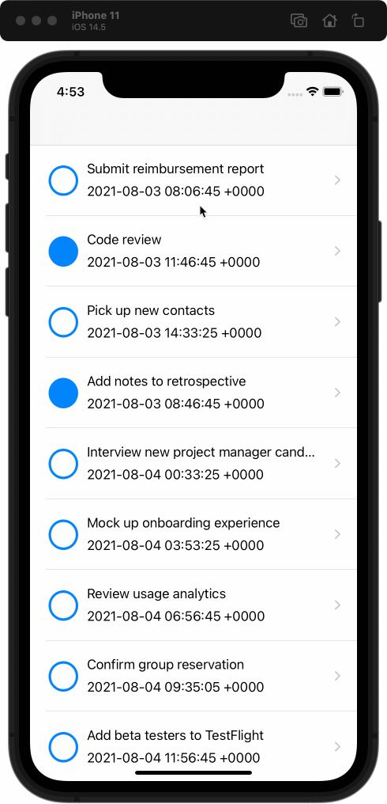

# [공식문서로 iOS 배우기] UIKit Tutorial - 3. Navigation

- 공식 자료를 학습하고 정리했으며 잘못된 정보가 있을 수 있습니다.
- 문서의 단순 번역은 `경어체`를, 직접 작성한 내용은 `평어체`를 사용합니다.
- 원문: Apple Developer - [iOS App Dev Tutorials - UIKit](https://developer.apple.com/tutorials/app-dev-training)
- [GitHub에서 보기](https://github.com/KyungminLeeDev/learning-with-apple-official-resources)

## 📱 결과물

## 📌 메모

배운 내용이나 메모는 소제목에 압정(`📌`) 이모지를 표시하여 작성하고 이곳에 링크합니다.

- [📌 Table view cell의 Disclosure Indicator](#-table-view-cell의-disclosure-indicator)

   

# Chapter 3. Navigation

미리 알림의 디테일을 보여주는 view를 만들고 이 view를 내비게이션 계층 안에서 표시합니다.

## Creating a Detail View Controller

모든 미리 알림은 고유한 프로퍼티가 있습니다. 사용자가 미리 알림에 대한 디테일을 볼 수 있도록 detail view controller를 만듭니다.  
  
익숙한 패턴을 따릅니다. 새로운 view controller을 추가하는 것으로 시작하고, 요구되는 두 개의 table view data source 메서드를 추가합니다.

### 1. Create A Reminder Detail View Controller

이번 섹션에서는 새로운 reminder detail view controller를 만듭니다. 앱은 table view를 사용하여 미리 알림의 디테일을 표시할 것입니다. table view의 각 행을 설명하는 열거형을 만듭니다.

### 2. Add Data Source Methods

이번 섹션에서는 table view data source 메서드를 구현합니다. `ReminderRow` 열거형에서 했던 작업으로 data source 메서드를 명확하고 간결하게 유지할 수 있습니다. Reusable cell은 table view가 최적으로 수행되도록 보장합니다.

### 3. Check Your Understanding

#### Q1. 정수를 raw value로 저장하는 열거형을 정의하는 방법은 무엇인가요?

~~~swift
enum Values: Int {...}
~~~

#### Q2. 열거형의 모든 케이스를 순회할 수 있게 하는 프로퍼티를 가지는 프로토콜은 무엇인가요?

CaseIterable

#### Q3. table view data source를 설정하기 위해 필요한 메서드는 무엇인가요?

~~~swift
tableView(_:numberOfRowsInSection:)
tableView(_:cellForRowAt:)
~~~

## Creating a Navigation Stack

사용자는 목록 화면에서 디테일 화면으로 찾아갈 방법이 필요합니다. navigation controller를 추가하여 앱의 워크플로우에 detail view controller를 통합합니다. 그런 다음 UIKit에 포함된 segue 중 하나를 사용하여 화면 간의 전환을 애니메이션화할 수 있습니다.

### 1. Create a Navigation Controller

이번 섹션에서는 reminder list view controller를 navigation controller에 내장합니다. 그리고 미리 알림의 디테일을 보여줄 새로운 table view controller을 만듭니다. 마지막으로 사용자가 미리 알림 cell을 탭 하여 두 view controller 사이를 이동할 수 있도록 segue를 만듭니다.

#### 📌 Table view cell의 Disclosure Indicator

table view cell의 Accessory 메뉴에서 Disclosure Indicator를 선택하면 cell의 우측에 오른쪽 화살표 모양이 생긴다.

> Step 2  
>  
> Disclosure Indicator는 이 cell을 탭 하면 새 scene으로 이동함을 사용자에게 알려줍니다.

위에 설명돼있듯이 이 cell을 누르면 새로운 화면으로 이동하여 더 자세한 내용을 볼 수 있다는 의미로 인식할 수 있다.

### 2. Perform a Segue

이번 섹션에서는 미리 알림의 디테일 화면을 표시하는 segue를 구성합니다. segue identifier를 확인하고 불러오는 view controller에 데이터를 주입합니다. 마지막으로, Today 앱의 새로운 내비게이션 기능을 테스트합니다.

### 3. Check Your Understanding

#### Q1. table view controller가 스토리보드에서 initial view controller로 되어있습니다. 이제 table view controller에 naigation controller를 내장했다면 무엇이 initial view controller 인가요?

Navigation controller

#### Q2. Interface Builder가 action과 outlet을 오브젝트에 연결할 수 있는지 결정하는 데 사용하는 것은?

Class identity

#### Q3. 어떤 segue가 UINavigationController 스택에 destination view controller를 푸쉬하는가?

Show

