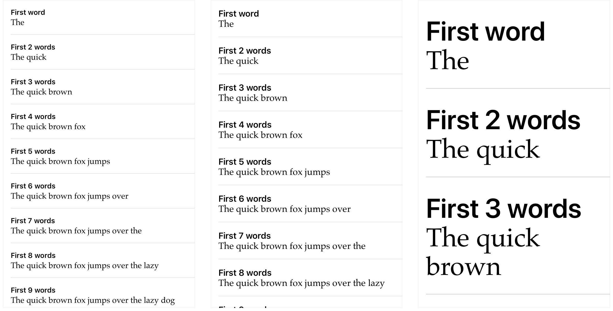

# Creating Self-Sizing Table View Cells

Create table view cells that support Dynamic Type and use system spacing constraints to adjust the spacing surrounding text labels.

## Overview

This sample code project shows how to create self-sizing table view cells that support Dynamic Type. Because Dynamic Type lets the user control the size of the text displayed in the cell, it's important that the cell resizes itself based on the text size.

The project also shows how to use Auto Layout constraints to automatically adjust the spacing surrounding text labels based on the text size. To demonstrate automatic spacing, the cell displays two [`UILabel`](https://developer.apple.com/documentation/uikit/uifont?language=swift) objects: a headline label and a body label.

## Add Dynamic Type Support

To add support for Dynamic Type, the cell assigns a scaled font to each label. For the headline label, the preferred font with the [`headline`](https://developer.apple.com/documentation/uikit/uifont/textstyle/1616702-headline?preferredLanguage=swift) text style is used. The preferred font is the system font, which can scale to different sizes. Its initial text size is determined by the font metric for the `headline` text style.

``` swift
headlineLabel.font = UIFont.preferredFont(forTextStyle: .headline)
headlineLabel.adjustsFontForContentSizeCategory = true
```

For the body label, a custom font is used. However, in order to support Dynamic Type with a custom font, a version of the font must be created that adopts the font metric for a particular text style. In the case of the body label, the Palatino custom font is used with the [`body`](https://developer.apple.com/documentation/uikit/uifont/textstyle/1616682-body?preferredLanguage=swift) text style.

``` swift
guard let palatino = UIFont(name: "Palatino", size: 18) else {
    fatalError("""
        Failed to load the "Palatino" font.
        Since this font is included with all versions of iOS that support Dynamic Type, verify that the spelling and casing is correct.
        """
    )
}
bodyLabel.font = UIFontMetrics(forTextStyle: .body).scaledFont(for: palatino)
bodyLabel.adjustsFontForContentSizeCategory = true
```

Before the effects of Dynamic Type can be seen, the [`adjustsFontForContentSizeCategory`](https://developer.apple.com/documentation/uikit/uicontentsizecategoryadjusting/1771731-adjustsfontforcontentsizecategor?language=swift) property must be set to `true` on each label. This property tells the label to automatically adjust the text size for its font when the user changes their preferred text size. For more information, see [Scaling Fonts Automatically](https://developer.apple.com/documentation/uikit/uifont/scaling_fonts_automatically).

## Use Auto Layout Constraints to Adjust Cell Size and Spacing

At this point, the two labels are able to adjust the size of their text automatically. However, the cell isn't able to adjust its size. Auto Layout constraints are needed to adjust the size and spacing of the cell's [`contentView`](https://developer.apple.com/documentation/uikit/uitableviewcell/1623229-contentview?language=swift) and the labels it contains.

## Set the Horizontal Position for Each Label

The width of both labels should extend to fill the width of the cell’s content view, and the headline label should appear above the body label. To accomplish this, Auto Layout constraints are added to each label starting with constraints that define the label width. For the headline label, constraints are added that tell the label to fill the space between the content view’s leading and trailing margins. For the body label, constraints are added that set its leading and trailing anchors equal to the headline label’s leading and trailing anchors.

``` swift
headlineLabel.leadingAnchor.constraint(equalTo: contentView.layoutMarginsGuide.leadingAnchor).isActive = true
headlineLabel.trailingAnchor.constraint(equalTo: contentView.layoutMarginsGuide.trailingAnchor).isActive = true

bodyLabel.leadingAnchor.constraint(equalTo: headlineLabel.leadingAnchor).isActive = true
bodyLabel.trailingAnchor.constraint(equalTo: headlineLabel.trailingAnchor).isActive = true
```

Setting the body label’s leading and trailing anchors equal to the leading and trailing anchors for the headline label ensures that the left and right edges of each label are always in the same position. This approach has an added benefit; adjusting either the left or right edge on the headline label automatically applies the changes to the body label. While this might seem trivial when there are only two labels, setting a label's leading and trailing anchors equal to the same anchors of another label can save you time when there are many more labels that must align their edges.

## Set the Vertical Position for Each Label

With the horizontal positioning in place, it’s time to set the vertical position for each label. Auto Layout constraints are once again used to position the vertical alignment, placing the headline text above the body text.

One way vertical positioning can be set is to add a constraint that defines the distance between the two labels based on some constant value. However, the problem with relying on a constant value is that you must adjust the value each time the text size changes; otherwise, the text may look scattered or cramped, making it difficult to read. With iOS 11 and later, you can avoid relying on and setting the constant value by using system spacing constraints.

A system spacing constraint sets the distance between two UI elements to a value based on information provided by the anchors used when creating the constraint. For example, a system spacing constraint can position a label’s [`firstBaselineAnchor`](https://developer.apple.com/documentation/uikit/uiview/1622508-firstbaselineanchor?language=swift) (the baseline for the topmost text in the label) below another label’s [`lastBaselineAnchor`](https://developer.apple.com/documentation/uikit/uiview/1622471-lastbaselineanchor?language=swift) (the baseline for the bottommost text in that label) at a distance defined by the system. The constraint ensures that adequate spacing is always applied between the two labels regardless of the text size, without adjusting the constraint’s constant value.

For the sample code project, the cell uses system spacing constraints to:

1. Set the spacing between the top of the cell’s content view and the headline label.
2. Set the spacing between the body label and the bottom of the cell’s content view.
3. Set the spacing between the headline and body labels.

``` swift
headlineLabel.firstBaselineAnchor.constraint(equalToSystemSpacingBelow: contentView.layoutMarginsGuide.topAnchor, multiplier: 1).isActive = true

contentView.layoutMarginsGuide.bottomAnchor.constraint(equalToSystemSpacingBelow: bodyLabel.lastBaselineAnchor, multiplier: 1).isActive = true

bodyLabel.firstBaselineAnchor.constraint(equalToSystemSpacingBelow: headlineLabel.lastBaselineAnchor, multiplier: 1).isActive = true
```

With the system spacing constraints in place, the system automatically adjusts the spacing surrounding the two labels based on the text size.



## Test with Accessibility Inspector

In order to test how the sample app reacts to different text sizes, run the app in Simulator and use Accessibility Inspector to change the text size. The inspector lets you test an app’s interface with different text sizes without switching between the app and the Settings app.

To use Accessibility Inspector, follow these steps:

1. Launch Xcode, then run your app.
2. From the Xcode menu bar, select **Xcode > Open Developer Tool > Accessibility Inspector** to launch the inspector.
3. In the upper left corner of the Accessibility Inspector, select **Simulator** as the target.
4. Click the *Settings* icon (shaped like a gear).
5. Move the *Font size* slider to change the size of text displayed in your app.
